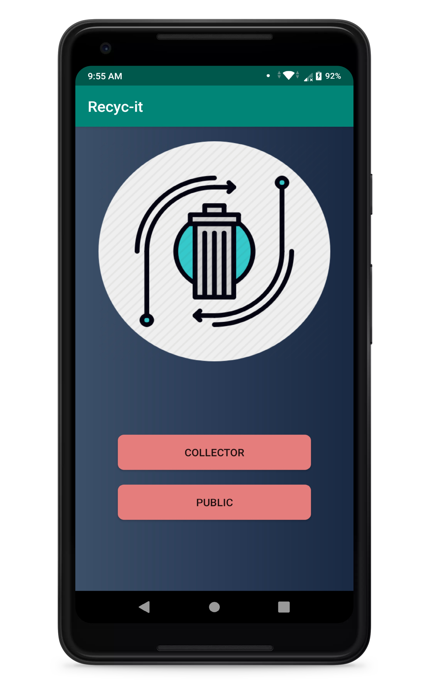
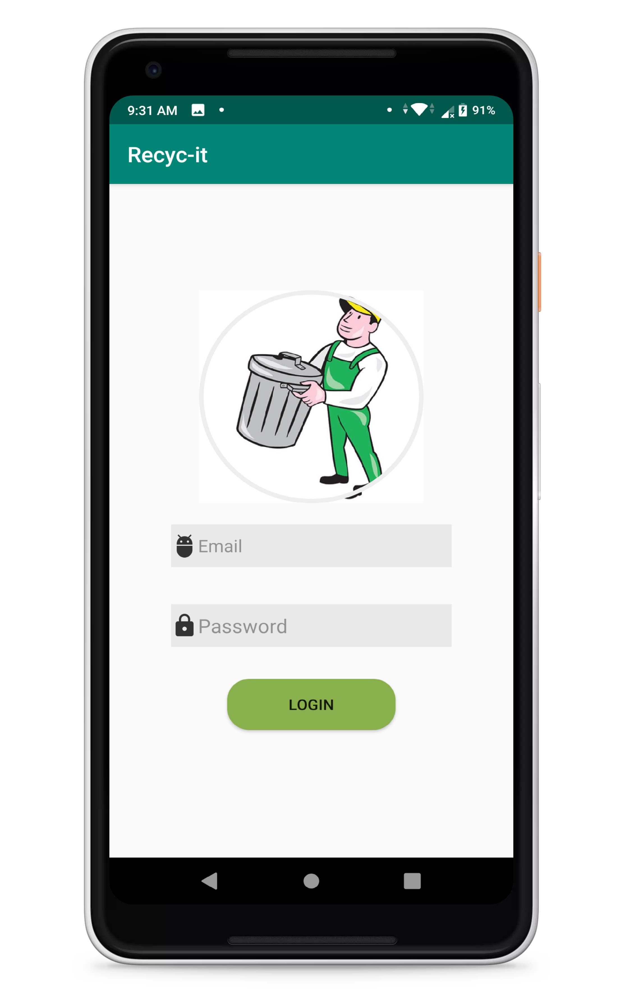
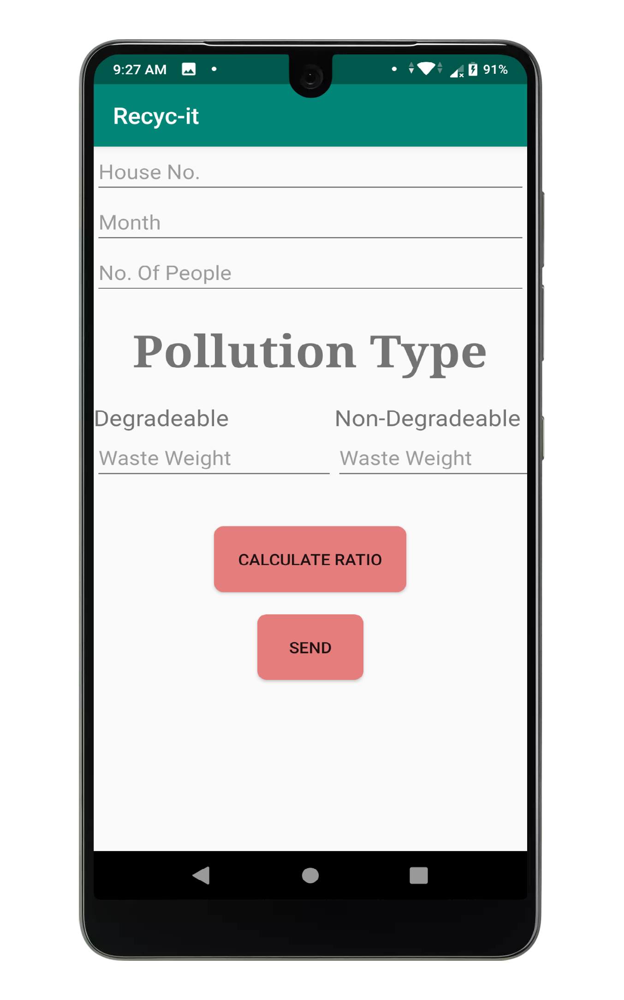
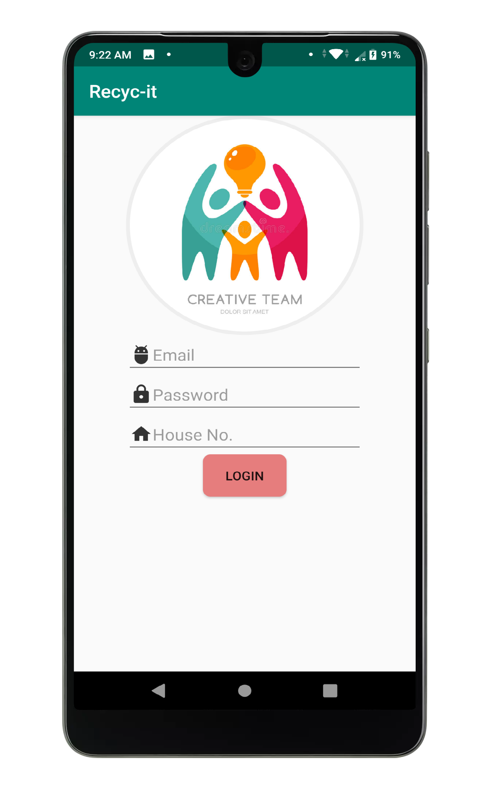
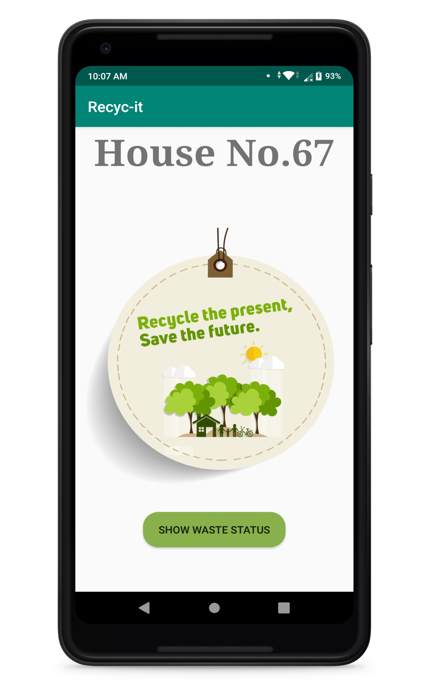
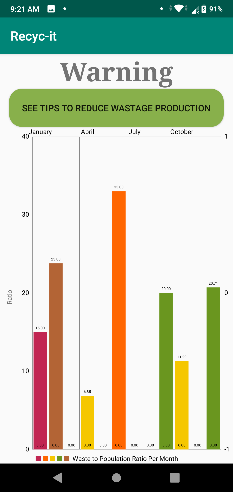
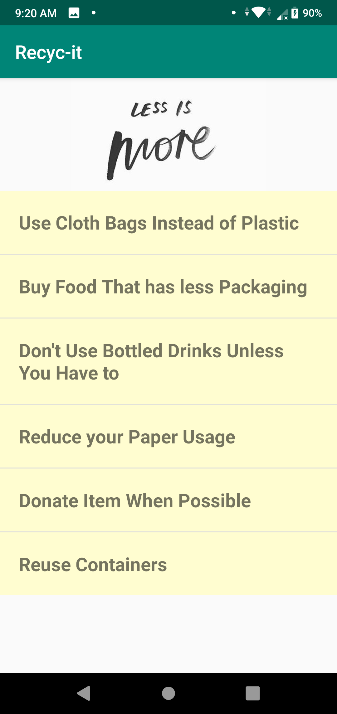

## Recyc-it
Tracks the users waste as per provided by the waste collector and provides them tips and warnings accordingly.
![Screenshot]
![Screenshot]
![Screenshot]
![Screenshot]
![Screenshot]
![Screenshot]
![Screenshot]
